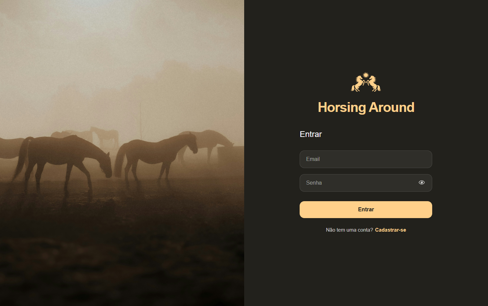
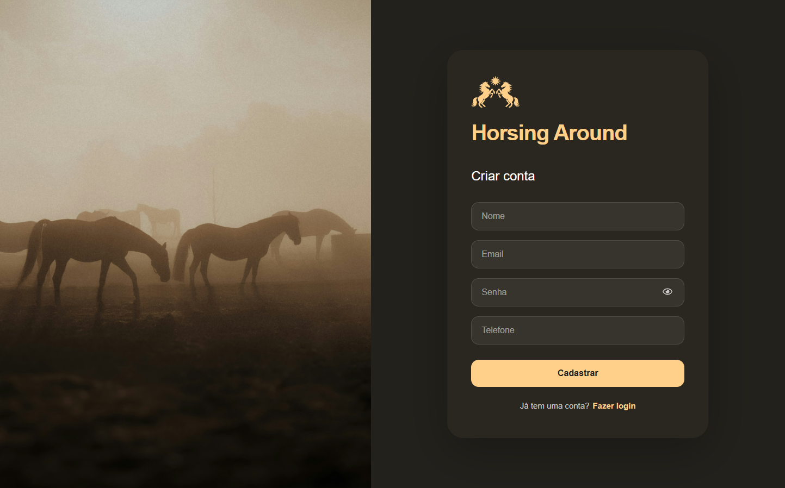
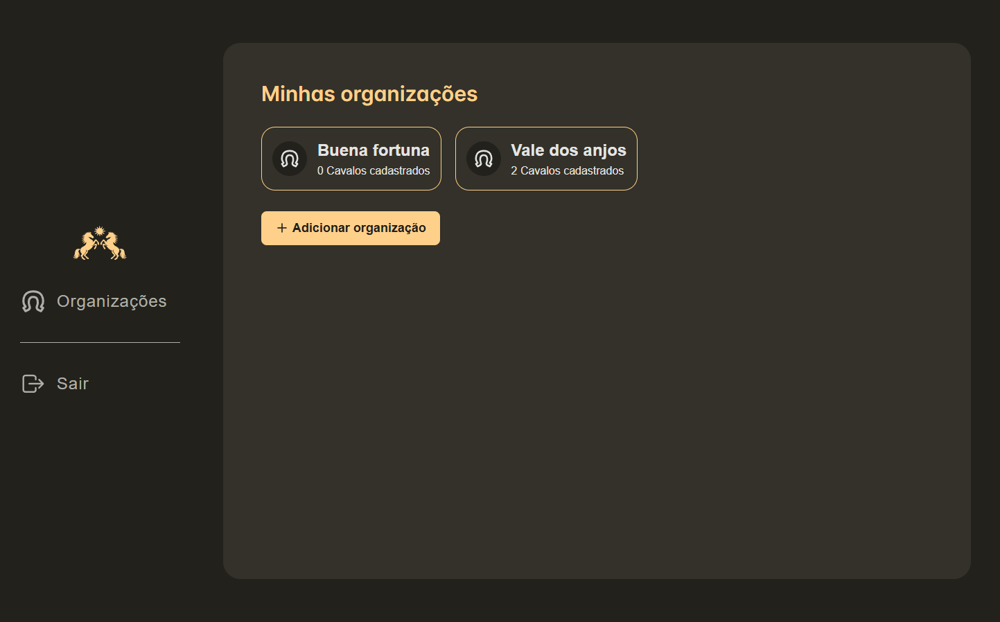
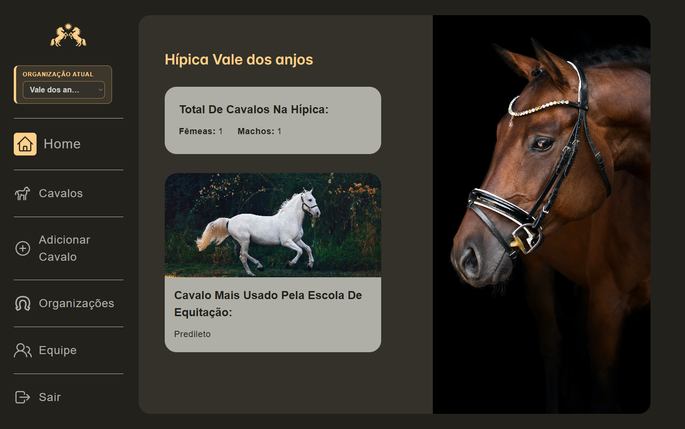
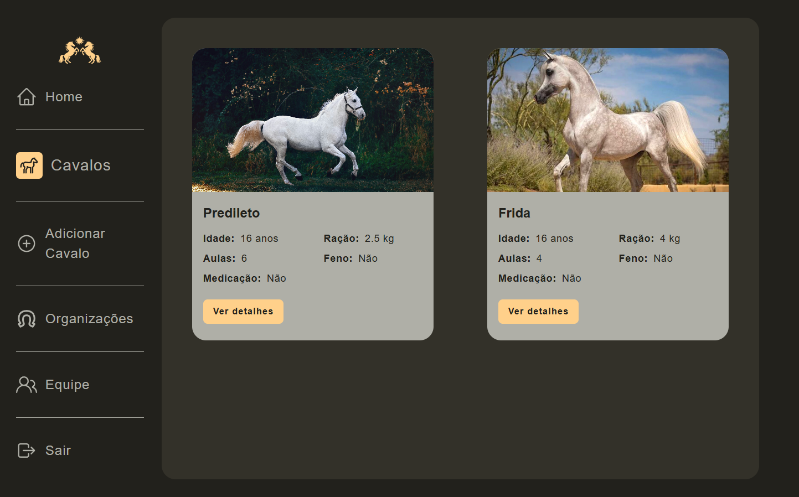
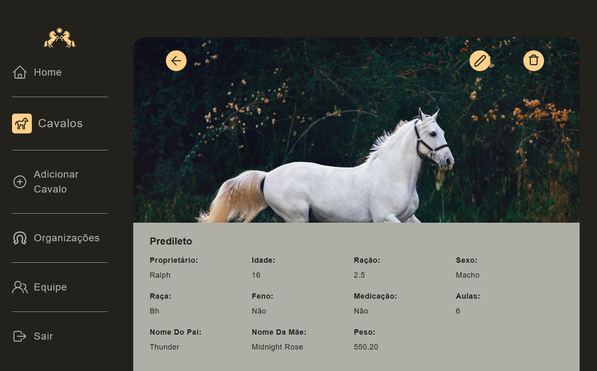
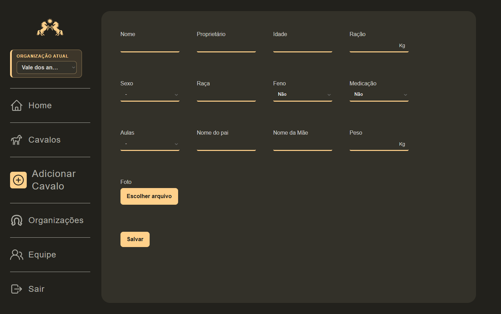
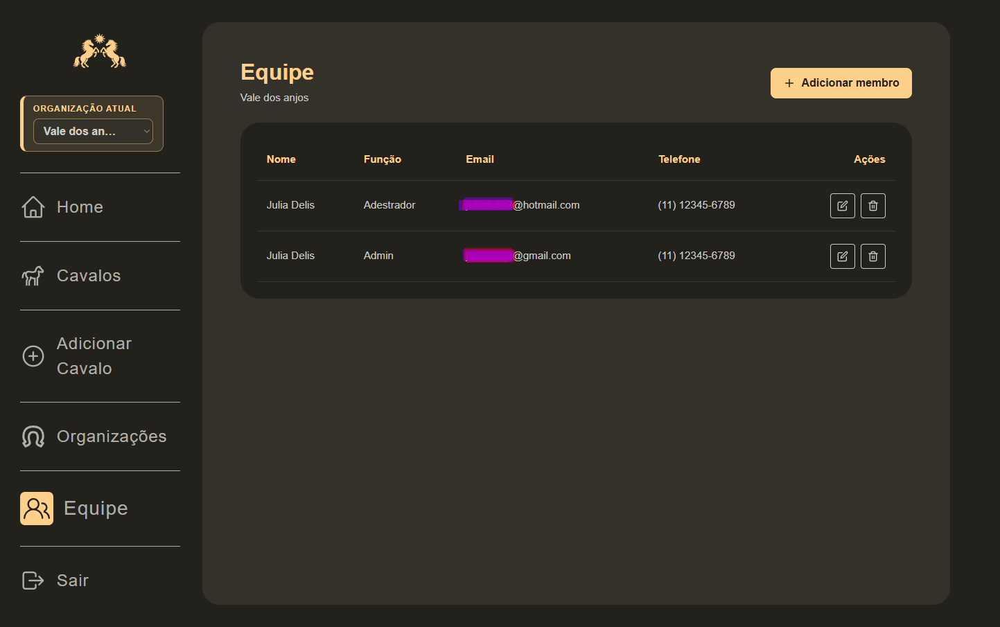

# Horsing Around

Horsing Around is a full-stack horse management platform for riding schools, stables, and equestrian organizations. It centralizes horse records, operational dashboards, organization access, and team member authorization in a private workspace.

Live project: https://horsing-around.vercel.app/

## Product Preview

### Login



### Registration



### Organization Selection



### Dashboard



### Horse List



### Horse Profile



### Horse Form



### Team Management



## Overview

The application is designed for teams that need a structured way to manage horses and organization access. Users can create organizations, register horses with detailed data and photos, monitor key operational indicators, and invite authorized members by email.

The current product supports multi-organization access, authenticated private routes, image uploads, and team authorization flows backed by Supabase Auth.

## Core Features

- Authentication with Supabase email and password accounts.
- Private application routes protected by the current Supabase session.
- Organization creation and organization switching.
- Horse registration with name, owner, age, breed, gender, weight, food amount, hay usage, lessons, parent names, medication status, treatment details, and photo upload.
- Horse listing with loading states and empty states.
- Horse detail view with edit and delete actions.
- Dashboard with organization context, male and female counts, medicated horses, and most-used riding school horse.
- Team management by authorized email, without manually creating passwords for members.
- Email invitation flow for members:
  - Existing users receive a login-oriented invite.
  - New users receive a registration-oriented invite.
  - Pending authorized emails are linked to the user account after login or registration.
- Duplicate member protection by email per organization.
- Toast feedback for success and error states.
- Submit and delete loading states for horse and team workflows.
- SPA fallback configuration for direct route access on Vercel.

## Tech Stack

### Frontend

- React 18
- Vite
- React Router
- Styled Components
- Axios
- Supabase JS Client
- React Toastify
- PrimeReact Dialog
- React Icons

### Backend

- Node.js
- Express
- PostgreSQL via `postgres`
- Supabase Auth
- Supabase Admin API through `SUPABASE_SERVICE_ROLE_KEY`
- Cloudinary
- Multer and Multer Cloudinary Storage
- CORS and dotenv

### Infrastructure

- Vercel for frontend deployment
- Supabase for authentication and database
- Cloudinary for horse photo storage

## Architecture

```txt
cliente/
  src/
    components/       Shared UI and domain components
    contexts/         Supabase auth session provider
    hooks/            Horse dashboard data composition
    pages/            Route-level screens
    routes/           Private and public route definitions
    services/         API and Supabase clients

backend/
  src/
    config/           Database, Supabase, and Cloudinary clients
    middlewares/      Supabase token authentication
    modules/
      auth/           Login and registration endpoints
      horses/         Horse CRUD and photo upload
      organizations/  Organization access and creation
      members/        Team authorization and invitation flow
```

## Member Invitation Flow

The team workflow is intentionally authorization-first:

1. An organization admin adds a member by email.
2. The backend checks whether the email is already authorized for the organization.
3. If the email is new, the member is stored in `organization_members`.
4. If the Supabase user already exists, the backend links `user_id` and sends a login invite.
5. If the user does not exist yet, the backend sends a registration invite.
6. When the invited person logs in or creates an account, pending organization access is linked by email.

This avoids creating passwords on behalf of users and keeps ownership of account creation with the invited person.

## API Surface

Authenticated routes require a Supabase bearer token.

```txt
POST   /auth/register
POST   /auth/login

GET    /organizations
POST   /organizations
GET    /organizations/:id

GET    /organizations/:organizationId/cavalos
GET    /organizations/:organizationId/cavalos/:id
POST   /organizations/:organizationId/cavalos
PUT    /organizations/:organizationId/cavalos/:id
DELETE /organizations/:organizationId/cavalos/:id

GET    /organizations/:organizationId/members
POST   /organizations/:organizationId/members
PATCH  /organizations/:organizationId/members/:memberId
DELETE /organizations/:organizationId/members/:memberId
```

## Getting Started

### Prerequisites

- Node.js 18 or newer
- A Supabase project
- A PostgreSQL connection string
- A Cloudinary account

### Backend Setup

```bash
cd backend
npm install
cp .env.example .env
npm run dev
```

Backend runs on:

```txt
http://localhost:8800
```

Required backend environment variables:

```env
DB_URL=
CLOUD_NAME=
API_KEY=
API_SECRET=
SUPABASE_URL=
SUPABASE_ANON_KEY=
SUPABASE_SERVICE_ROLE_KEY=
FRONTEND_URL=http://localhost:5173
```

Important: `SUPABASE_SERVICE_ROLE_KEY` must only exist on the backend. Never expose it in the frontend.

### Frontend Setup

```bash
cd cliente
npm install
npm run dev
```

Frontend runs on:

```txt
http://localhost:5173
```

If the frontend environment file is used in your deployment, keep only public client values there, such as the frontend API URL and Supabase public anon key.

## Development Quality Notes

- API access is centralized through service modules on the frontend.
- Auth state is provided by a React context.
- Private routes wait for Supabase session resolution before redirecting.
- Backend modules are organized by domain.
- Member invitations are idempotent by organization email.
- Loading and toast states are implemented across critical save and delete flows.

